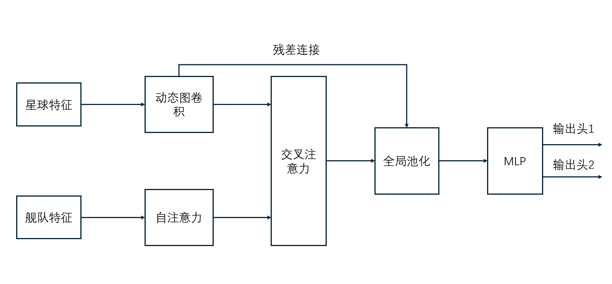

# Orbit-Wars 建模方案

## 1. 输入定义

设：

- **星球特征**：$$Z_p \in \mathbb{R}^{N_1 \times F_p^*}$$
- **舰队特征**：$$Z_f \in \mathbb{R}^{N_2 \times F_f^*}$$

其中 $F_p^*$ 和 $F_f^*$ 表示所有特征的缩略记号，$N_1$ 和 $N_2$ 分别为当前时间步的星球数量和舰队数量。

---

## 2. 星球特征：图神经网络（GNN）

对星球特征使用图神经网络进行空间关系建模。

### 2.1 邻接矩阵（可学习）

邻接矩阵每个元素通过星球特征间的双线性运算得到：

$$a_{ij} = z_i W_a z_j^{\mathsf{T}}$$

其中：
- $z_i, z_j \in Z_p$（即 $Z_p$ 的第 $i$ 行和第 $j$ 行，代表行星 $i$ 和 $j$ 的特征向量）
- $W_a \in \mathbb{R}^{F_p^* \times F_p^*}$ 为可学习参数
- $a_{ij} \in A_g$，最终邻接矩阵 $A_g \in \mathbb{R}^{N_1 \times N_1}$

**归一化**：对 $A_g$ 沿行方向做 softmax，得到归一化邻接矩阵：

$$A_g = \text{softmax}_{\text{row}}(A_g)$$

使得每行的权重之和为 $1$，避免特征量级大的节点主导消息传递，同时保证梯度稳定。

### 2.2 图卷积层

每一层图卷积的运算定义为：

$$Z_p^{(n)} = \sigma\left(A_g \, Z_p^{(n-1)} \, W_g^{(n)}\right)$$

其中：
- $\sigma$ 为激活函数
- $W_g^{(0)} \in \mathbb{R}^{F_p^* \times h_g}$（输入层）
- $W_g^{(n)} \in \mathbb{R}^{h_g \times h_g}$，$n > 0$（隐藏层）
- $h_g$ 为图卷积的隐藏层维度
- 每层输出 $Z_p^{(n)} \in \mathbb{R}^{N_1 \times h_g}$

经过全部图卷积层后，星球特征表示为：

$$Z_p \in \mathbb{R}^{N_1 \times h_g}$$

---

## 3. 舰队特征：自注意力（Self-Attention）

对舰队特征使用自注意力进行空间关系建模，使每个舰队能够感知其他舰队的状态。

具体计算过程：

### 3.1 QKV 计算

$$\begin{aligned}
Q_f &= Z_f W_{fq}, \quad & W_{fq} &\in \mathbb{R}^{F_f^* \times h_f} \\
K_f &= Z_f W_{fk}, \quad & W_{fk} &\in \mathbb{R}^{F_f^* \times h_f} \\
V_f &= Z_f W_{fv}, \quad & W_{fv} &\in \mathbb{R}^{F_f^* \times h_f}
\end{aligned}$$

其中 $h_f$ 为自注意力的隐藏层维度。输出形状：

$$Q_f, K_f, V_f \in \mathbb{R}^{N_2 \times h_f}$$

### 3.2 缩放点积注意力

$$Z_f = \text{softmax}\left(\frac{Q_f K_f^{\mathsf{T}}}{\sqrt{h_f}}\right)V_f$$

最终舰队特征表示为：

$$Z_f \in \mathbb{R}^{N_2 \times h_f}$$

其中 $h_f$ 为自注意力输出层维度。

---

## 4. 交叉注意力：星球→舰队 信息融合

将星球特征作为 **Query**，舰队特征作为 **Key** 和 **Value** 进行注意力计算，再将结果作为残差加到星球特征上。

### 4.1 QKV 计算

$$\begin{aligned}
Q &= Z_p W_q, \quad & W_q &\in \mathbb{R}^{h_g \times h_a} \\
K &= Z_f W_k, \quad & W_k &\in \mathbb{R}^{h_f \times h_a} \\
V &= Z_f W_v, \quad & W_v &\in \mathbb{R}^{h_f \times h_a}
\end{aligned}$$

其中 $h_a$ 为注意力头的维度。输出形状：

$$Q \in \mathbb{R}^{N_1 \times h_a}, \quad K, V \in \mathbb{R}^{N_2 \times h_a}$$

### 4.2 缩放点积注意力

$$Z_a = \text{softmax}\left(\frac{QK^{\mathsf{T}}}{\sqrt{h_a}}\right)V$$

输出 $Z_a \in \mathbb{R}^{N_1 \times h_a}$。

因为这里是用星球特征作为查询去查舰队特征，所以得到的是每个星球学习到对舰队相关性的舰队信息聚合。在最终输出层决策的时候，主要基于星球的状态进行决策，因为星球的状态相对于舰队较为固定，且舰队的派遣是基于地图中星球的情况进行决策的。因此再用残差加到原来的星球特征上，作为最终输出层的输入特征。

### 4.3 残差连接与维度映射

$$Z = Z_a W_p + Z_p$$

其中 $W_p \in \mathbb{R}^{h_a \times h_g}$ 负责将注意力输出映射回星球特征的维度，便于残差相加。

---

## 5. 输出层

将 $Z$ 在 $N_1$ 维度上做平均池化，消掉星球数量维度：

$$Z_{\text{pooled}} = \frac{1}{N_1}\sum_{i=1}^{N_1} Z_i \in \mathbb{R}^{h_g}$$

将池化后的特征送入 MLP 输出头：

- **Policy Head**：$Z_{\text{pooled}}$ → MLP → $\mathbb{R}^{\text{max\_sources} \times \text{actions\_per\_source}}$
- **Value Head**：$Z_{\text{pooled}}$ → MLP → $\mathbb{R}$
